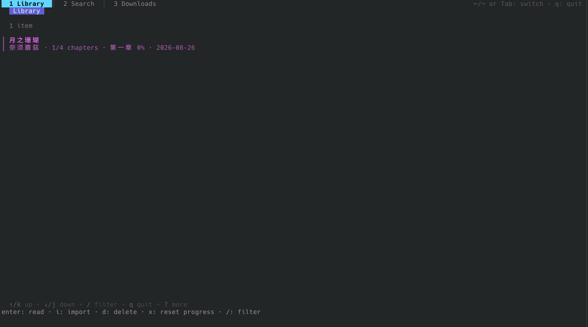
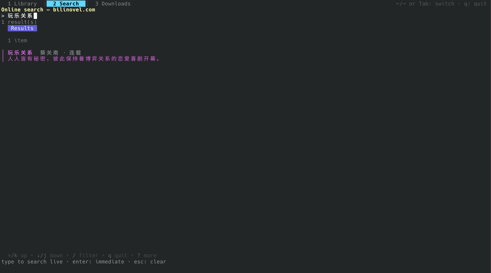
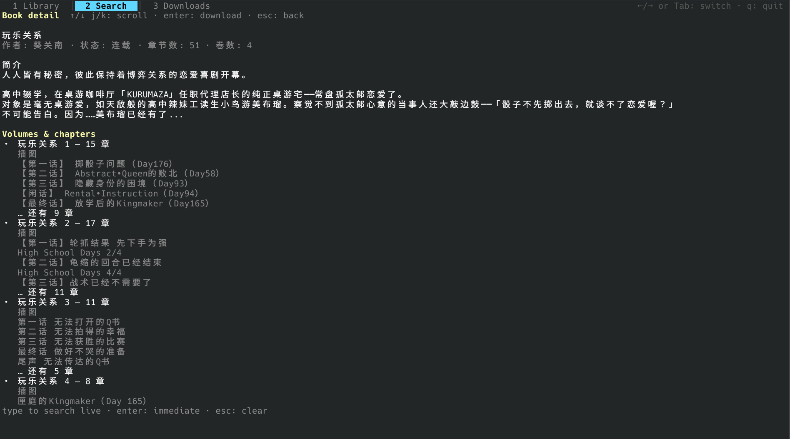
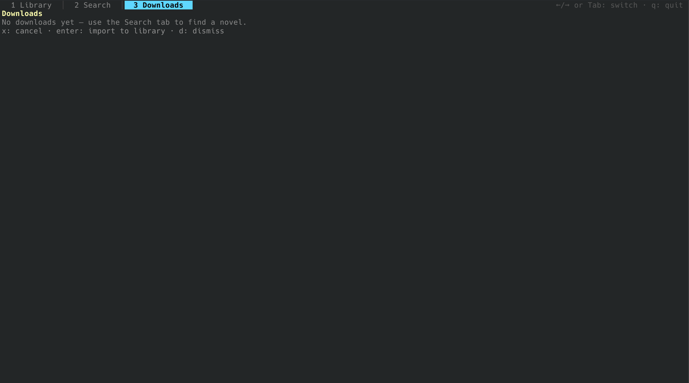
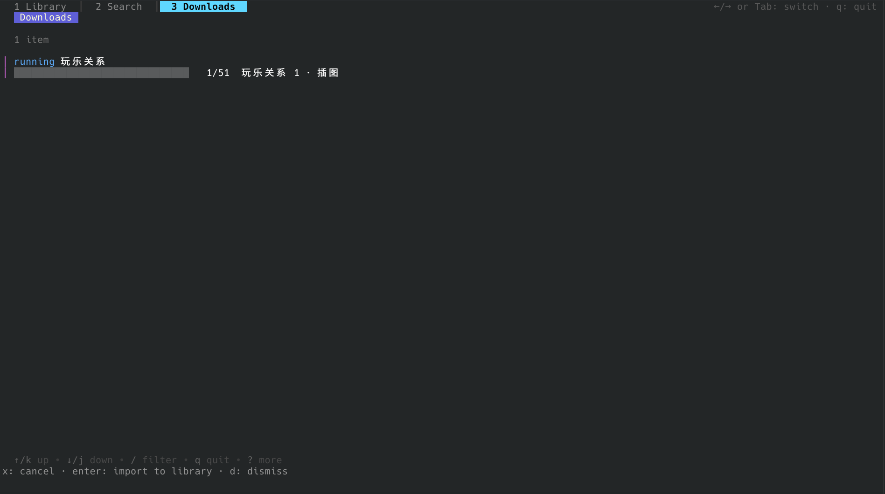
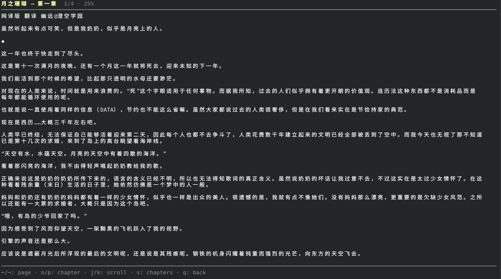
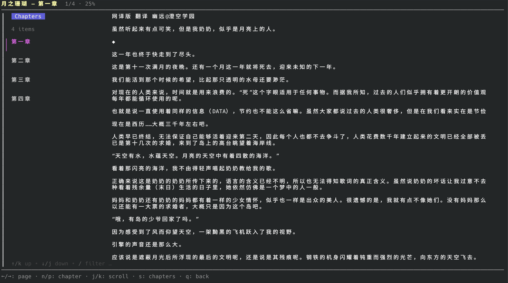

# LNReaderTUI

一个终端里的轻小说阅读器。搜索 **bilinovel.com** 的小说，一键下载为 EPUB，在终端里阅读，并自动记录每一本书的阅读进度——全部运行在你自己的机器上。

基于 [bubbletea](https://github.com/charmbracelet/bubbletea) 构建；站点抓取逻辑移植自 [bili_novel_packer](https://github.com/montaro2017/bili_novel_packer)。

## 截图

| | |
|---|---|
|  |  |
| *书库 — 章节级阅读进度* | *在线搜索 — 输入即搜* |
|  |  |
| *书籍详情 — 简介 + 卷/章结构* | *下载任务列表* |
|  |  |
| *下载进度 — 显示当前卷与章节* | *阅读器 — 翻页式阅读* |
|  | |
| *侧边栏 — 章节列表与跳转* | |

## 功能特性

### 📚 书库
- 导入本地 `.epub` / `.txt`（文件或目录；也支持 `-import` 命令行批量导入）
- 列表展示标题、作者、章节总数，以及**章节级阅读进度**：`1/4 chapters · 第一章 2%`
- 删除图书（`d`）、重置进度（`x`）、本地过滤（`/`）

### 🔍 搜索（bilinovel.com）
- 直接在后端复现站点的 Jieqi 搜索防护流程（css/js/redeem cookie 链 + Chrome TLS 指纹），无需 Cookie 或浏览器
- **输入即搜**：输入稳定 500ms 后自动搜索（去抖、过期请求自动取消、结果实时更新）
- 结果列表 → **Enter 打开书籍详情页**：作者、出版社、状态、评分、标签、完整简介，以及**卷/章结构**（如 `玩乐关系 1 — 15 章`、章节标题预览）；详情页支持滚动

### 📥 下载
- 从详情页一键下载：抓取目录、多页章节、插图，按站点节流限速（文本 4s / 图片 6s）
- 下载任务实时显示**当前卷 · 章节**进度（`12/85 · 第二卷 · Case-03 …`），可取消（`x`）
- 完成后**自动导入书库**；产出的 EPUB 按卷分组目录（TOC）

### 📖 阅读器
- 翻页式阅读：`←` / `→` / `h` / `l` 翻页，章节末尾自动进入下一章；`n` / `p` 直接切章
- `s` 打开左侧**章节面板**：上下键选择、Enter 跳转、同步高亮当前章节
- 自动保存：章节切换、翻页、每 10s 定时、退出时均会写入进度（章节号 + 页内偏移），下次打开原位置继续

### 🔤 多平台
- Linux / Windows（amd64、arm64）/ macOS（arm64）均可构建运行
- 文件路径全部使用跨平台实现；下载暂存目录用系统临时目录（Windows 为 `%TEMP%`）

## 安装与运行

**方式〇：Homebrew（macOS / Linux）**

```bash
brew tap hhdtc/tap
brew trust hhdtc/tap                    # Homebrew 5.x+：信任第三方 tap（仅首次）
brew install lnreadertui                # 安装预编译 bottle，无需 Go / Xcode
```

升级：`brew update && brew upgrade lnreadertui`；卸载：`brew uninstall lnreadertui`。

> Homebrew 5.x 起第三方 tap 需要显式信任（`brew trust hhdtc/tap`）。查看公式内容可先执行 `brew cat hhdtc/tap/lnreadertui`。

**方式一：直接下载二进制**（无需安装 Go）

从 [Releases](https://github.com/hhdtc/LNReaderTUI/releases) 下载对应平台的二进制即可：

| 平台 | 文件 |
|---|---|
| Linux x64 | `lnreadertui-linux-amd64` |
| Windows x64 | `lnreadertui-windows-amd64.exe` |
| macOS Intel | `lnreadertui-darwin-amd64` |
| macOS Apple Silicon | `lnreadertui-darwin-arm64` |

```bash
chmod +x lnreadertui-linux-amd64   # Linux/macOS 首次使用需赋予执行权限
./lnreadertui
```

**方式二：从源码构建**（Go 1.22+）

```bash
go build -o lnreadertui .
```

运行：

```bash
./lnreadertui

# 批量导入（不启动界面）
./lnreadertui -import ~/books

# 自定义数据目录
./lnreadertui -data-dir /path/to/dir
```

## 命令行（适合脚本 / AI Agent）

无需进入界面即可完成整个流程；所有命令都支持 `--json` 输出，方便程序消费；下载任务在前台运行，`Ctrl+C` 干净取消（SIGINT/SIGTERM）。

```bash
# 搜索（可以给 URL 或 novel id，会先搜索）
lnreadertui search "玩乐关系" --json

# 书籍详情：作者/状态/简介 + 卷/章结构（含每卷章节数）
lnreadertui detail 4649
lnreadertui detail "玩乐关系"

# 下载：默认下载并登记到书库；--out 只写出 EPUB 不登记
lnreadertui download "玩乐关系"            # → 书库
lnreadertui download 4649 --out novel.epub # → 指定文件
# 参数顺序不限（旗标放查询前后均可）

# 本地书库管理
lnreadertui books list                     # id | 标题 | 章节 | 进度...
lnreadertui books list --json
lnreadertui books show <id|标题>
lnreadertui books reset <id|标题>          # 重置阅读进度
lnreadertui books delete <id|标题>         # 删除书籍与文件
lnreadertui import <path...>               # 导入 .epub/.txt 或目录
```

> AI Agent 提示：`lnreadertui -h` 列出全部子命令与参数；`<subcommand> -h` 查看单个命令的选项。

示例：AI Agent 一键循环——

```bash
lnreadertui search "玩乐关系" --json
lnreadertui detail "$QUERY" --json
lnreadertui download "$QUERY"              # 完成后打印书库路径
lnreadertui books list --json              # 验证已入库并查看进度
```

## 快捷键

| 视图 | 按键 |
|---|---|
| 全局 | `←/→` / `Tab` 切换标签页 · `1/2/3` 跳转 · `q` 退出 · `ctrl+c` 退出 |
| 书库 | `enter` 阅读 · `i` 导入 · `d` 删除 · `x` 重置进度 · `/` 过滤 |
| 搜索 | 输入即搜 · `enter` 立即搜索 · `↓` 聚焦结果 · `enter` 打开详情 |
| 详情 | `↑/↓ j/k pgup/pgdn` 滚动 · `enter` 下载 · `esc` 返回 |
| 下载 | `x` 取消 · `d` 移除 |
| 阅读器 | `←/→ h/l` 翻页 · `n/p` 切章 · `j/k` 滚动 · `s` 章节面板 · `q` 返回 |

## 数据存放

| 平台 | 数据目录（`library.json` + `books/`） |
|---|---|
| Linux | `~/.local/share/lnreadertui/`（尊重 `$XDG_DATA_HOME`） |
| Windows | `%LOCALAPPDATA%\lnreadertui\` |
| macOS | `~/.local/share/lnreadertui/` |

下载的书籍会自动导入数据目录，删除书籍会删除对应文件。

## 测试

```bash
go test ./...                 # 单元测试 + 黄金 fixture 测试
RUN_LIVE=1 go test ./internal/site/ ./internal/pipeline/ -run Live   # 访问真实站点
```

黄金测试复用站点抓取 fixture：模板参数解析与章节内容还原均与参考实现逐段比对，站点页面结构变化时会直接失效报警。

## 实现说明

- `internal/site` — bilinovel 搜索与下载（目录/章节/插图/限速），逻辑移植自 [bili_novel_packer](https://github.com/montaro2017/bili_novel_packer)
- `internal/epub` — EPUB 组装（写）与解析（读：spine/manifest/正文抽取），TXT 分章
- `internal/model` — 书库索引 + 阅读进度（JSON 存储，原子写入）
- `internal/pipeline` — 下载 → EPUB 组装编排
- `internal/tui` — bubbletea 界面（书库 / 搜索+详情 / 下载 / 阅读器）

**Windows 注意**：建议使用 Windows Terminal（或 WSL）运行——bubbletea 需要 VT 终端支持；经典 `cmd.exe` 下颜色与全屏渲染可能异常。
